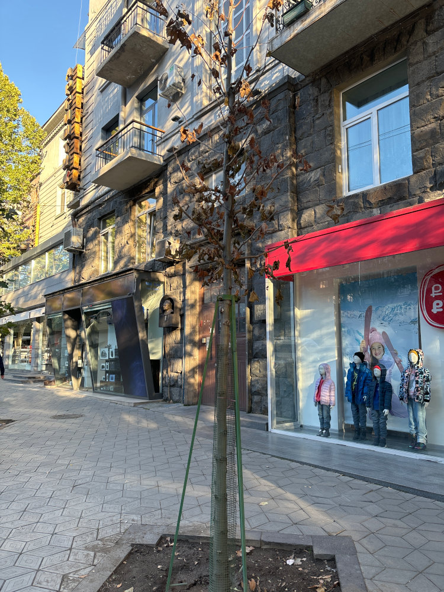
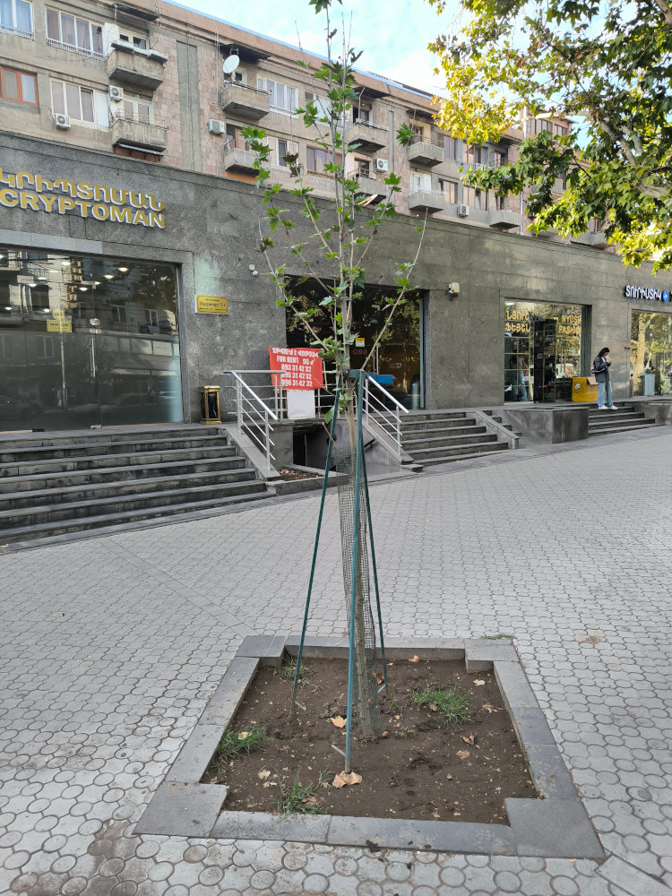
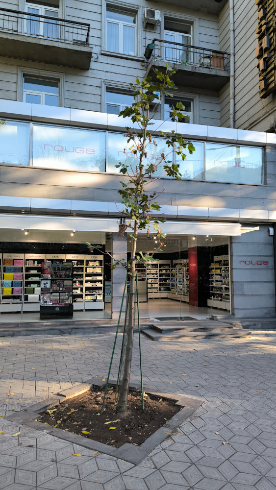
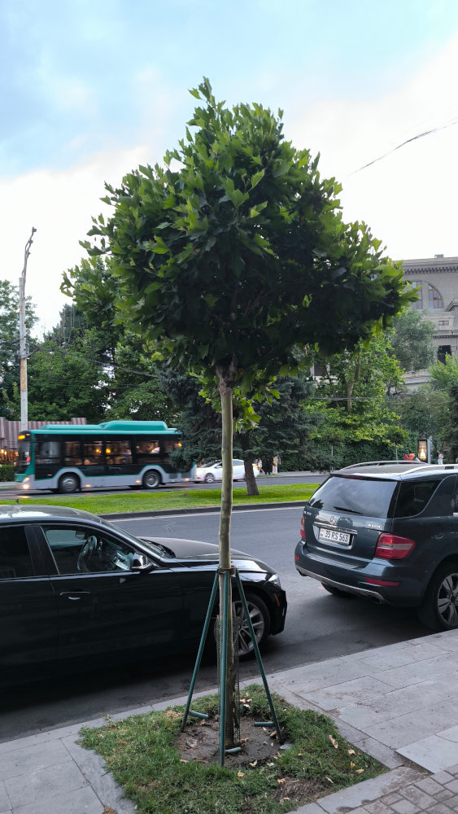

+++
title = "Crown Quality Assessment"
description = "Technical specifications for checking the quality of newly planted trees against international standards."
date = "2026-06-19"

[extra]
status = "recommended"
title = "Crown Quality"
verdict_short = "Crown Ratio 2:1"
description = "A healthy tree must have a balanced crown-to-trunk ratio and a clear central leader to survive in the urban environment."
+++

Every year, many new trees are planted in Yerevan. We don't know the exact number, but the volume is significant. However, planting a tree is only half the battle; the quality of the nursery stock determines whether that tree will become a shade-providing giant or a costly liability that dies within three years.

As a citizen or a professional, you can evaluate the quality of new plantings using three simple technical checks derived from European and American standards.

## Crown height

The crown size directly relates to the amount of leaves and the size of the root ball. Leaves are essential for photosynthesis, providing the energy the tree needs to establish itself in its new location. A disproportionately small crown means the tree will be stressed, will suffer, and will spend years recovering its canopy instead of growing and developing.

Let's examine a standard tree planted on the streets of Yerevan, which has a 4 m height and 14-16 cm circumference at breast height. Note that there is no published standard for these parameters, but this is the de-facto standard that we observe on the streets.

Russian standard [GOST 59370-2021](https://allgosts.ru/91/040/gost_r_59370-2021) mandates that trees have at least 45% of their height allocated for the crown. For a standard 4-meter tree, this means at least 180–185 cm of crown height (section 10.4.4.5). While it does not set a crown spread requirement, it specifies that the tree must have 7–9 skeletal branches (section 10.2.7), and they must not have been truncated or stubbed (section 4.4.3).

The [European Tree Pruning Standard (EAS 01:2024)](/guidelines/legal/eac-pruning/) specifies that for young trees, the crown-to-stem ratio should be at least 1:1, so the tree should have at least 2 meters tall crown (section 5.2.3). Furthermore, it specifies that the tree must have at least 3 branches (ENA section 1.2.1) and they should not be truncated (section 3.3.4). The standard does not set a minimum crown spread.

The American standard [ANSI Z60.2-2025](https://americanhort.org/education/american-nursery-stock-standards/) specifies a crown-to-stem ratio of 1:1 for young trees of this size, meaning a 4-meter tree should have at least a 2-meter crown (section 1.1.2.4). Furthermore, it defines the minimum height-to-spread ratio as 3:2, meaning the crown spread should be at least 2.6 meters for a 4-meter tree (section 4.2.4).

## The Central Leader

A quality urban tree should have a single, strong vertical stem that continues to the very top. This is called the "central leader."

- Good: one clear "main" branch pointing straight up.
- Bad: "codominant" stems (two or more leaders competing for dominance), which create weak V-shaped junctions prone to splitting.
- Bad: "topped" trees where the main leader has been cut, forcing weak, bushy growth.

## Structural Integrity and Defects

Before a tree is accepted from a nursery, it must be free of physical and biological defects. A "new" tree should never have:

- dry or dead branches: even small dead tips can indicate root stress or disease.
- bark inclusions: bark growing "inside" a branch junction, which creates a structural weak point.
- crossing branches: limbs that rub against each other, creating wounds that invite infection.
- trunk damage: any mechanical wounds to the bark from transportation or planting.

## Why these standards matter

In Yerevan's harsh climate, trees are already under extreme stress. If we start with subpar "nursery rejects" that lack a proper leader or a balanced crown, we are setting them up for failure. By demanding adherence to these standards, we ensure that municipal budgets are spent on living infrastructure, not disposable greenery.
