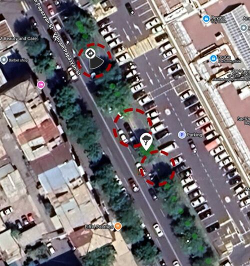
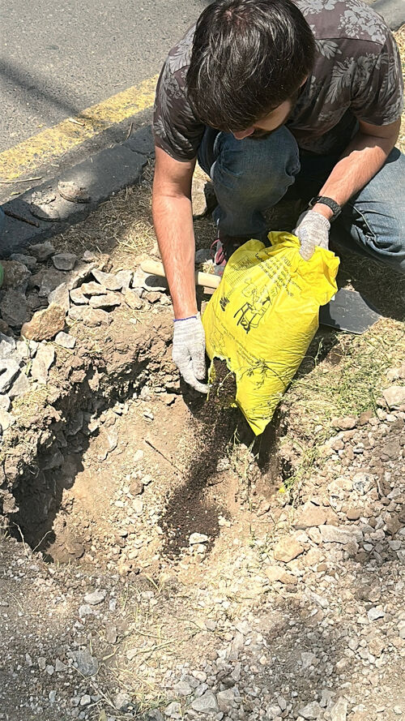
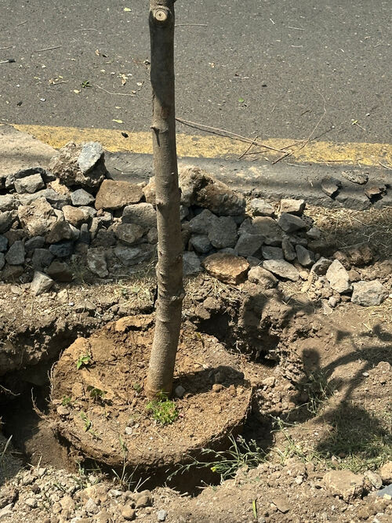
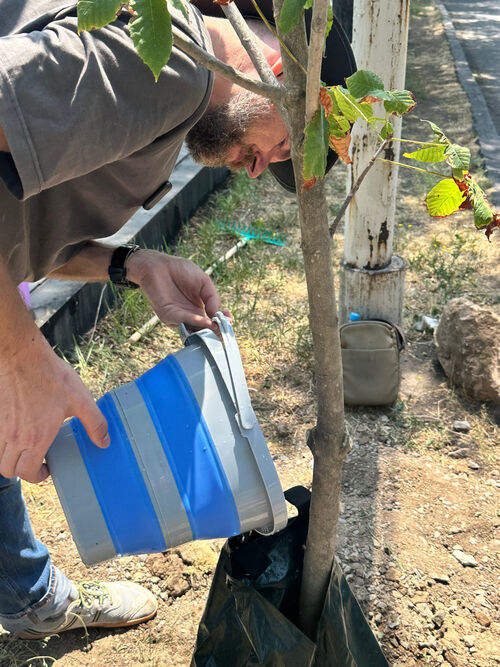
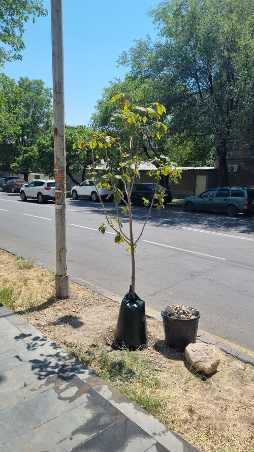
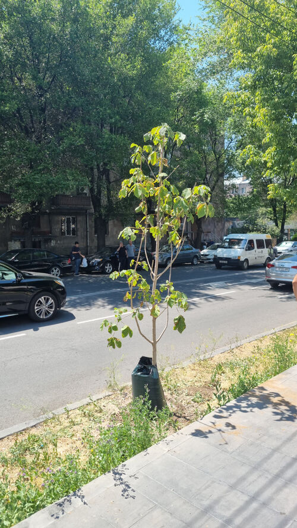

+++
title = "Առաջին համաձայնեցված ծառատունկը"
+++
Պապազյան փողոցում հաջողությամբ տնկեցինք երկու ծառ։

Շաբաթ օրը՝ հուլիսի 4-ին, տնկեցինք մեր առաջին ծառերը՝ համաձայնեցված «Կանաչապատում» ՀՈԱԿ-ի հետ։ Տնկվել է 3.5 մետր բարձրությամբ երկու ձիակասկ։

Հնարավոր է՝ շատերդ եք տեսել, թե ինչպես են երևանցիների նախաձեռնությամբ տնկված ծառերը երբեմն [հեռացվում են քաղաքի կանաչապատման ծառայության կողմից](https://www.facebook.com/kanachyerevanam/posts/pfbid02WdLmdA3BXVqp7Gwm29mhaPPL8auMRpnfYxQe5L1TX6QY5AJySq79DMN3CfYdJZxNl?rdid=2botEorfosFXmIjW), եթե դրանք համաձայնեցված չեն և գտնվում են գլխավոր փողոցների երկայնքով։ Ցավալի է, երբ այդպես կորչում են ներդրված ջանքերն ու միջոցները։

Կան մի քանի օբյեկտիվ պատճառներ, թե ինչու է ավելի լավ, որ տնկումները համաձայնեցվեն մասնագետների հետ։ Օրինակ՝ կարող է պարզվել, որ.

* առաջարկվող վայրը հարմար չէ, եթե ծառը փակում է ճանապարհային նշանների տեսանելիությունը, կամ եթե ստորգետնյա կոմունիկացիաների պատճառով արմատային համակարգի համար բավարար տեղ չկա
* քաղաքացու ընտրած ծառատեսակը կա՛մ ինվազիվ է, կա՛մ զգալիորեն քիչ էկոհամակարգային ծառայություններ է մատուցում՝ համեմատած առկա այլընտրանքների հետ, կամ չի համապատասխանում թիրախային կենսաբազմազանությանը։ Հուսով ենք, որ նման էկոլոգիական նպատակները շուտով կհայտնվեն Երևանի քաղաքային պլանավորման գործիքակազմում

Այդ իսկ պատճառով մենք բանակցում ենք քաղաքապետարանի և «Կանաչապատման» հետ՝ փողոցների երկայնքով քաղաքացիական ծառատունկերի համաձայնեցման հստակ և մատչելի ընթացակարգ ստեղծելու նպատակով։ Բակում ծառ տնկելու համար համաձայնեցում չի պահանջվում։

Ամիսներ տևած բանակցությունների արդյունքում հասանք շոշափելի արդյունքի՝ իրականացրինք առաջին համաձայնեցված տնկումը մեր ընտրած տեղամասում։

Մենք ընտրեցինք Պապազյան փողոցի Rio Mall-ին հարակից հատվածը, քանի որ.

* փողոցն ակտիվորեն օգտագործվում է հետիոտների կողմից
* այս հատվածում ծառերի շարքում արդեն երեք «բացթողում» էր առաջացել
* երկու «բացերը» շրջապատում են մի [խոշոր թեղի, որն այժմ առնվազն 75 մ² ստվեր է տալիս](https://yerevan.treemaps.app/tree/414482186205532160/preview), բայց գտնվում է գրեթե վթարային վիճակում։ Քանի դեռ թեղին դիմանում է, պետք է կողքին ծառեր աճեցնել, որոնք կփոխհատուցեն նրա ստվերի կորուստը
* մեկ միջակայքը հարմար չէր, քանի որ ծառը կփակեր ճանապարհային նշանը
* մի քանի տարեցներ մոտեցան մեզ և նշեցին հենց այս հատվածում ստվերի անհրաժեշտությունը
* մոտակայքում կան ջրի աղբյուրներ՝ ոռոգման պարկերը լցնելու համար

Տեսակն ու չափսերը սահմանվել էին «Կանաչապատման» կողմից. այս փողոցում նրանք թույլատրեցին ձիակասկ տնկել, և մենք գտանք բարձրությամբ ու բնի հաստությամբ համապատասխան տնկիներ։

Ուրբաթ առավոտյան տեղամաս ժամանեցին «Կանաչապատման» դենդրոլոգները և համաձայնեցրին տնկման հստակ վայրերը։ Երեկոյան տնկարանը բերեց տնկիները, որոնք մինչև առավոտ մնացին հարևան ռեստորանի հսկողության տակ։ Շաբաթ առավոտյան «Կանաչապատման» ևս երկու աշխատակից եկան՝ տնկմանը հետևելու համար։

Առաջին փուլը՝ փոսերի փորումը, ամենածանրն ու երկարն է (չհաշված համաձայնեցումը)։ Մենք բախվեցինք սպասելի դժվարության. հողը քարքարոտ է և 10 սանտիմետրից խորը ավելի շատ նման է ռեգոլիթի, քան հողի։ Դա հիմնականում անցյալի «ժառանգությունն» է՝ թափված շինարարական աղբը։ Մեզ օգնության հասավ լոմը։ Դրանով մենք հանեցինք հին ասֆալտի շերտեր, տուֆի կտորներ, բետոնի բեկորներ, վանակատի (օբսիդիան) խիճ և մի հսկայական քար։ Որպեսզի այդ քարերը չհայտնվեն երթևեկելի մասում, դրանք հավաքեցինք տնկիների զամբյուղի մեջ։

Երկրորդ փուլը բավականին պարզ է.

1. յուրաքանչյուր փոսի հատակին ավելացնել սնուցող հող
2. զգուշորեն բունը դնել ուղղահայաց դիրքով
3. հանված հողը կա՛մ լցնել փոսի մեջ, կա՛մ տարածել շրջակա հողի վրա (իսկ քարերը՝ հավաքել)
4. տեղադրել և լցնել ոռոգման պարկը
5. անհրաժեշտության դեպքում մայթից լվանալ հողի փոշին. դրա բարակ շերտը սահող է և վտանգավոր
6. տոնել

Հետևելով ավանդույթին՝ մենք սուրճ խմեցինք, որով մեզ հյուրասիրեց դիմացի շենքի բնակիչ Արայիկը։ Նրա հետ դեռ երկար խոսեցինք այն մասին, թե ինչու են ոռոգման պարկերն ավելի լավ, քան փողրակով ջրելը, և ինչպես կարելի է օգնել Հայաստանի տնտեսության զարգացմանը։

Ցանկանո՞ւմ եք ծառ տնկել Երևանի փողոցներում։ [Գրե՛ք մեզ](https://t.me/make_yerevan_green_again)։
